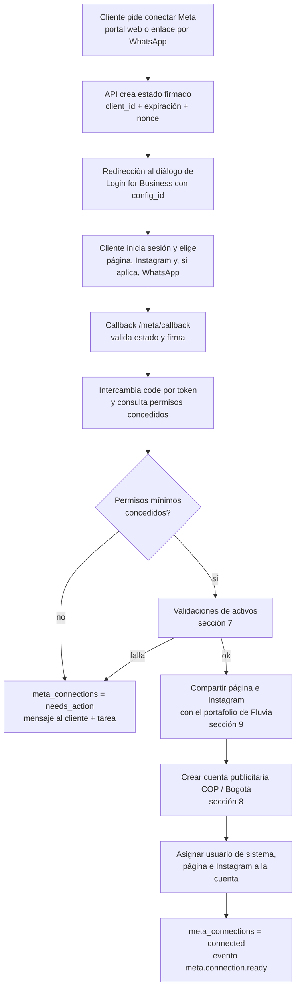
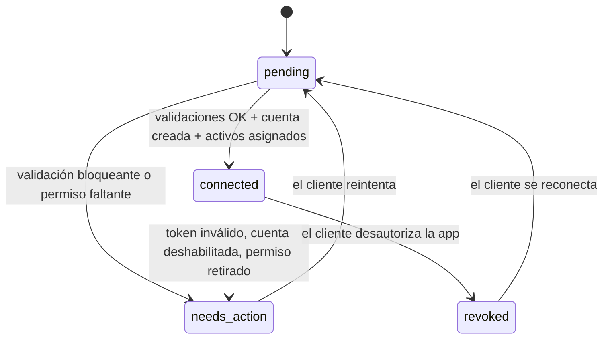

# Plan de integración con Meta (paso 2)

Estado: **borrador de diseño, sin código.** Fecha: 2026-10-02.
Alcance: conexión de un cliente con Meta, validaciones, creación de la cuenta publicitaria, asignación de activos, errores, reintentos y límites. Todo el acceso a Meta vive en `packages/meta` (regla de CLAUDE.md).

## 0. Cómo leer este documento

**Límite de verificación.** Al escribirlo, `developers.facebook.com` estaba bloqueado por el proxy de salida del entorno. No pude leer la documentación oficial de Meta. Lo único contrastado fue la versión vigente de la Graph API, y solo por fuentes secundarias (ver sección 19). Todo nombre de endpoint, campo, permiso, código de error y límite numérico sale de memoria y **debe verificarse contra la documentación oficial antes de implementar**.

Leyenda:

| Marca                  | Significado                                                                                                                                                                          |
| ---------------------- | ------------------------------------------------------------------------------------------------------------------------------------------------------------------------------------ |
| (sin marca)            | Decisión de diseño propia de Fluvia.                                                                                                                                                 |
| 🔶 **Verificar**       | Creo que es así, pero no está confirmado en la documentación oficial. Verificar antes de implementar.                                                                                |
| 🔴 **Depende de Meta** | No sé si Meta lo expone por API, o si Fluvia tendrá acceso. Hasta confirmarlo se asume **no disponible** y el paso cae a una tarea humana de un clic (`tasks`), como pide CLAUDE.md. |

El punto 17 reúne todas las marcas en una lista con responsable.

## 1. Principios

1. Solo API oficial de Meta (Marketing API / Graph API) con app aprobada y usuario de sistema. Sin scraping ni cuentas compartidas (regla 1).
2. Una cuenta publicitaria por cliente, dentro del portafolio exclusivo de Fluvia, nunca el de Roisense (regla 3).
3. Nunca probar contra cuentas reales de clientes. Desarrollo contra sandbox; piloto solo con marcas propias (regla 7).
4. Secretos solo en variables de entorno o `wrangler secret` (regla 8). Los tokens de clientes no se guardan en el repo y, por diseño, **tampoco se persisten** (ver 3.3).
5. Cada escritura en Meta y cada decisión de IA o humana se registra en `audit_log` (regla 5).
6. Cualquier falla crea una fila en `tasks` en lugar de detener el flujo. Cada tarea debe resolverse con un clic o con la mínima acción humana posible (métrica: minutos humanos por campaña).
7. Cobrar antes de gastar: este plan crea y deja lista la cuenta, pero **no activa presupuesto**. Eso depende del webhook de Coloca (regla 2, paso 3).

## 2. Versión de la Graph API

- **Recomendación: fijar `v26.0`** (Graph API y Marketing API), en **una sola constante** dentro de `packages/meta`. Ninguna URL se arma fuera de ese módulo.
- Según fuentes secundarias 🔶: v26.0 salió el 2026-07-29; v25.0 el 2026-02-18; la Marketing API v24.0 expira el 2026-10-06. Por eso no se parte de v24.
- Cambios de v26.0 relevantes para nosotros 🔶: se eliminaron los emplazamientos _Instagram Explore Feed_ y _Messenger Stories_. Las plantillas deben usar emplazamientos automáticos y no pedir esos dos.
- Política de actualización: revisar el changelog de Meta cada trimestre y antes de que expire la versión en uso. Subir de versión es un PR propio, con tests de contrato (sección 15).
- 🔶 Confirmar en la página oficial de versiones la fecha de expiración de v26.0 y la política de vida útil de cada versión.

## 3. Piezas y credenciales

### 3.1 Piezas

| Pieza                 | Descripción                                                                                                                                                      |
| --------------------- | ---------------------------------------------------------------------------------------------------------------------------------------------------------------- |
| App de Meta de Fluvia | Tipo _Business_, con el producto Facebook Login for Business y la Marketing API.                                                                                 |
| Portafolio de Fluvia  | Business Portfolio exclusivo de Fluvia (no el de Roisense). Es el **dueño de las cuentas publicitarias**.                                                        |
| Usuario de sistema    | System user del portafolio de Fluvia. Su token hace todas las llamadas de servidor.                                                                              |
| Activos del cliente   | Página de Facebook, cuenta de Instagram profesional y, opcionalmente, WhatsApp y píxel. **Siguen siendo del cliente**; Fluvia solo recibe permiso para anunciar. |

### 3.2 Tokens

| Token                                             | Uso                                                                                | Vida útil                                                                                                                                                                   |
| ------------------------------------------------- | ---------------------------------------------------------------------------------- | --------------------------------------------------------------------------------------------------------------------------------------------------------------------------- |
| Token de usuario del cliente (Login for Business) | Solo durante el onboarding: leer sus páginas, roles y activos, y validar permisos. | 🔶 Corto al inicio; canjeable por uno largo (~60 días). Confirmar el comportamiento con Login for Business.                                                                 |
| Token del usuario de sistema de Fluvia            | Todas las operaciones de servidor: crear cuenta, asignar, campañas, métricas.      | 🔶 Los tokens de system user pueden ser sin vencimiento o con vencimiento. Confirmar cuál ofrece Meta hoy y elegir el que venza (más seguro) si el costo operativo es bajo. |

Variables ya definidas: `META_APP_ID`, `META_APP_SECRET`, `META_SYSTEM_USER_TOKEN`, `META_BUSINESS_ID`, `META_SANDBOX_AD_ACCOUNT_ID`.

### 3.3 Qué se guarda del cliente

**Decisión vigente (cambió respecto al borrador original): el token de usuario del cliente SÍ se guarda, cifrado.** El borrador proponía descartarlo tras el onboarding; el equipo decidió conservarlo cifrado. Detalles:

- Se guarda en `meta_connections.access_token_encrypted` con AES-256-GCM (`v1.<iv>.<datos>`, IV aleatorio por registro). El `client_id` va como dato autenticado (AAD), así que un cifrado copiado a otra fila no se descifra. La llave es el secreto `TOKEN_ENCRYPTION_KEY` (32 bytes en base64). El prefijo `v1` deja espacio para rotación de llaves (todavía no implementada).
- También se guarda `token_expires_at` con el vencimiento que reporte Meta. 🔶 No está confirmado si Login for Business entrega un token largo o si hace falta un segundo intercambio.
- **Hoy nada lee ese token** salvo el propio callback. Si la fase 2e logra que el usuario de sistema de Fluvia opere con la página del cliente (sección 9), conviene volver a la idea original y dejar de guardarlo: menos superficie ante una filtración y cláusula de datos más simple (Ley 1581, pendiente del abogado).
- Se guarda además en `meta_connections`: `page_id`, `ig_id`, `ad_account_id`, destinos de mensajes, `pixel_id`, `permissions` (los concedidos) y `status`.
- Los tokens nunca van a logs, a `audit_log`, a `tasks` ni a las URLs.

🔴 Sigue en pie la duda de la sección 9: si el usuario de sistema de Fluvia puede operar con la página y el Instagram del cliente tras el onboarding.

## 4. Permisos

Principio: pedir el mínimo. Cada permiso extra amplía el App Review y la superficie de riesgo.

### 4.1 Necesarios en el MVP

| Permiso                 | Para qué                                                                                             | Nota                                                         |
| ----------------------- | ---------------------------------------------------------------------------------------------------- | ------------------------------------------------------------ |
| `ads_management`        | Crear y gestionar campañas, conjuntos y anuncios.                                                    | 🔶 Requiere acceso avanzado para operar activos de terceros. |
| `ads_read`              | Leer cuentas, campañas y métricas (`metrics_daily`).                                                 | 🔶                                                           |
| `business_management`   | Crear la cuenta publicitaria en el portafolio, asignar usuarios y páginas, leer activos del negocio. | 🔶                                                           |
| `pages_show_list`       | Listar las páginas del cliente y los roles/tareas de su usuario.                                     |                                                              |
| `pages_read_engagement` | Leer datos de la página (publicación, Instagram vinculado).                                          | 🔶                                                           |
| `pages_manage_ads`      | Anunciar desde la página del cliente.                                                                | 🔶                                                           |
| `instagram_basic`       | Leer la cuenta de Instagram vinculada y confirmar que es profesional.                                | 🔶                                                           |

### 4.2 Condicionales

| Permiso                        | Cuándo                                                                                                                     | Nota                                                                                                  |
| ------------------------------ | -------------------------------------------------------------------------------------------------------------------------- | ----------------------------------------------------------------------------------------------------- |
| `whatsapp_business_management` | Solo si el cliente elige WhatsApp como destino: leer la cuenta de WhatsApp Business y sus números para validar el vínculo. | 🔴 No está confirmado que la cuenta de WhatsApp gestionada por Kapso sea accesible desde nuestra app. |
| `pages_manage_metadata`        | Solo si nos suscribimos a webhooks de la página.                                                                           | 🔶 Probablemente no se necesite en el MVP.                                                            |
| `instagram_manage_insights`    | Solo si se decide leer métricas orgánicas de Instagram.                                                                    | No se necesita para pauta.                                                                            |

### 4.3 No se piden en el MVP

- `pages_messaging`, `instagram_manage_messages`, `whatsapp_business_messaging`: la conversación con el cliente final la maneja Kapso; los anuncios que abren una conversación no necesitan que nuestra app lea los mensajes. 🔶 Confirmar que los anuncios con destino Messenger e Instagram Direct no exigen estos permisos.
- `instagram_content_publish`, `catalog_management`, `leads_retrieval`: fuera del alcance del MVP.

### 4.4 Acceso estándar vs. avanzado

🔶 Para operar activos de clientes ajenos hay que pasar **App Review** con acceso avanzado en los permisos de 4.1, y completar la **verificación de negocio** de Fluvia. Hasta entonces, en modo desarrollo solo funcionan usuarios con rol en la app. Los tiempos de revisión de Meta no los controlamos; es un riesgo de calendario (ver 5).

## 5. Prerrequisitos en Meta (checklist previa al código de producción)

- [ ] Portafolio de Fluvia creado, **separado de Roisense**, y con verificación de negocio 🔶.
- [ ] App creada y vinculada al portafolio de Fluvia.
- [ ] Producto _Facebook Login for Business_ añadido y una **configuración** creada con los permisos de 4.1 y 4.2.
- [ ] Usuario de sistema creado en el portafolio y token generado (guardado con `wrangler secret`).
- [ ] URL de política de privacidad y URL de eliminación de datos (callback) publicadas: Meta las exige para apps con inicio de sesión 🔶.
- [ ] Screencasts y descripciones de uso por permiso para el App Review 🔶.
- [ ] Cuenta publicitaria sandbox creada (`META_SANDBOX_AD_ACCOUNT_ID`).
- [ ] 🔴 Confirmar con Meta el **límite de cuentas publicitarias por portafolio** y cómo se amplía (ver 8.4). Es el mayor riesgo del modelo "una cuenta por cliente".

## 6. Flujo de conexión (Facebook Login for Business)



Pasos y decisiones:

1. **Inicio.** El enlace de conexión lo genera la API para un `client_id`. El parámetro `state` es un valor firmado (HMAC con un secreto de la app) que incluye `client_id`, expiración corta (por ejemplo 30 minutos) y un nonce de un solo uso. El nonce se guarda en un Durable Object o en la base para impedir reutilización (CSRF y replay).
2. **Diálogo.** Se abre el diálogo de Login for Business apuntando al `config_id` de Fluvia. 🔶 Confirmar los parámetros exactos del diálogo y de la respuesta (`code` frente a token directo) en la documentación de Login for Business.
3. **Callback.** `apps/api` valida `state`; rechaza expirado, reutilizado o con firma inválida. Un `error` de Meta (el cliente canceló) deja la conexión en `pending` y no crea tarea: es una decisión del cliente.
4. **Token y permisos.** Se canjea el `code` y se consulta qué permisos concedió realmente el usuario (los permisos pueden concederse parcialmente, y Login for Business permite elegir activos). 🔶 La inspección del token (`debug_token`) y de los permisos _granulares_ por activo debe confirmarse.
5. **Idempotencia.** Una conexión por cliente (`meta_connections.client_id` es único). Reconectar actualiza la fila existente; no crea otra.
6. **Concurrencia.** Todo el bloque de los pasos 7 a 9 corre bajo el **lock por cliente** (Durable Object `CLIENT_LOCK`) para que dos callbacks simultáneos no creen dos cuentas publicitarias.
7. **Resultado.** `connected` y evento `meta.connection.ready` en Queues. Si algo falla: `needs_action` y una fila en `tasks`.

## 7. Validaciones al conectar

Cada validación devuelve un código estable. El código se mapea a un mensaje al cliente en español colombiano y a una acción interna. Si falla alguna **bloqueante**, no se crea la cuenta publicitaria.

| Código                | Validación                                                                                                             | Cómo se comprueba                                                                                                                                                                                                                                                                  | Bloqueante                                                                | Si falla                                                                                         |
| --------------------- | ---------------------------------------------------------------------------------------------------------------------- | ---------------------------------------------------------------------------------------------------------------------------------------------------------------------------------------------------------------------------------------------------------------------------------- | ------------------------------------------------------------------------- | ------------------------------------------------------------------------------------------------ |
| `PERMISSIONS_MISSING` | Se concedieron los permisos de 4.1 (y 4.2 si aplica).                                                                  | Consulta de permisos del token. 🔶                                                                                                                                                                                                                                                 | Sí                                                                        | Pedir al cliente que repita el inicio de sesión aceptando todo.                                  |
| `PAGE_NOT_ADMIN`      | El usuario es **administrador** de la página (control total).                                                          | Listar sus páginas con sus _tareas_; exigir la tarea de control total (`MANAGE`) y la de anunciar. 🔶 Nombres de las tareas por confirmar.                                                                                                                                         | Sí                                                                        | "Necesitas ser administrador de la página. Pídele a quien la administra que te dé acceso total." |
| `BUSINESS_NOT_ADMIN`  | Si la página pertenece a un portafolio de negocio del cliente, el usuario es administrador de ese portafolio.          | Roles del usuario en el negocio dueño de la página. 🔶                                                                                                                                                                                                                             | Sí                                                                        | Igual que arriba. Solo aplica si la página tiene portafolio propietario.                         |
| `PAGE_UNPUBLISHED`    | La página está publicada.                                                                                              | Campo de publicación de la página. 🔶                                                                                                                                                                                                                                              | Sí                                                                        | Pedir publicarla.                                                                                |
| `PAGE_RESTRICTED`     | La página **no tiene restricciones** (publicitarias o de calidad).                                                     | 🔴 No sé si hay un campo de API que exponga restricciones de página. **Plan B:** crear un anuncio en modo validación (`validate_only`) contra esa página; un error de política o restricción lo delata. 🔶 Confirmar que `validate_only` existe y qué errores devuelve.            | Sí                                                                        | Tarea humana: revisar la página en Meta Business Support.                                        |
| `IG_NOT_PROFESSIONAL` | La página tiene una cuenta de Instagram vinculada y es **profesional** (Business o Creator).                           | Campo de cuenta de Instagram vinculada a la página; si no existe, la cuenta es personal o no está vinculada. 🔶                                                                                                                                                                    | Sí (solo si el cliente eligió Instagram Direct o publicidad en Instagram) | "Pasa tu Instagram a cuenta profesional y vincúlalo a tu página" con enlace a la guía.           |
| `WA_NOT_LINKED`       | Si el cliente eligió WhatsApp: hay un número de WhatsApp Business **vinculado a la página o accesible para anunciar**. | 🔴 Dos comprobaciones distintas: (a) el número existe y está activo en la cuenta de WhatsApp Business (requiere `whatsapp_business_management`); (b) el vínculo número-página que usan los anuncios de clic a WhatsApp. No está confirmado que (b) se pueda leer ni crear por API. | Sí (solo si eligió WhatsApp)                                              | **Tarea humana de un clic** (vincular en Meta Business Suite) hasta confirmar la API.            |
| `WA_KAPSO_ACCESS`     | El número gestionado por Kapso es visible para nuestra app.                                                            | 🔴 No confirmado. Es una pregunta para Kapso (¿en qué portafolio vive su WABA y cómo se comparte?).                                                                                                                                                                                | Sí (si eligió WhatsApp)                                                   | Tarea humana.                                                                                    |
| `MESSENGER_DISABLED`  | Si el cliente eligió Messenger: la página recibe mensajes.                                                             | 🔴 No sé si es legible por API.                                                                                                                                                                                                                                                    | No (advertir)                                                             | Mensaje informativo al cliente.                                                                  |
| `PIXEL_OPTIONAL`      | Si el cliente tiene web y quiere píxel: se puede crear o asociar.                                                      | Ver 9.4.                                                                                                                                                                                                                                                                           | No                                                                        | Se omite; la campaña corre sin píxel.                                                            |
| `AD_ACCOUNT_LIMIT`    | El portafolio puede crear otra cuenta publicitaria.                                                                    | 🔴 No hay un endpoint conocido que devuelva el cupo restante; se detecta por el error al crear (8.4).                                                                                                                                                                              | Sí                                                                        | Tarea humana inmediata a Angela/Mauricio.                                                        |

Reglas generales:

- Las validaciones **de solo lectura** se ejecutan primero y todas juntas, para devolver al cliente **todos** los problemas en una sola respuesta y no uno por intento.
- Los mensajes al cliente son texto fijo en español colombiano, sin detalles técnicos de Meta.
- Cada resultado (aprobado o fallido) se guarda en `audit_log` con el código, sin tokens.

## 8. Cuenta publicitaria en el portafolio de Fluvia

### 8.1 Creación

- La cuenta se crea **dentro del portafolio de Fluvia** (`META_BUSINESS_ID`) con el token del usuario de sistema, nunca con el token del cliente. 🔶 Endpoint de creación de cuenta publicitaria en un portafolio (propiedad del negocio) por confirmar.
- Campos principales (todos 🔶 por confirmar):

| Campo                            | Valor                                                                                                                                                                                                      | Nota                                                                                                                                                                                                           |
| -------------------------------- | ---------------------------------------------------------------------------------------------------------------------------------------------------------------------------------------------------------- | -------------------------------------------------------------------------------------------------------------------------------------------------------------------------------------------------------------- |
| nombre                           | `FLV_{clientId}`                                                                                                                                                                                           | Determinista: permite reconciliar (8.3).                                                                                                                                                                       |
| moneda                           | `COP`                                                                                                                                                                                                      | **No se puede cambiar después de crear la cuenta.** 🔶                                                                                                                                                         |
| zona horaria                     | `America/Bogota`                                                                                                                                                                                           | Meta pide un **identificador numérico** de zona horaria, no el nombre IANA. 🔶 Resolver el id de Bogotá en la lista de Meta y fijarlo en configuración; no escribirlo de memoria. No se puede cambiar después. |
| anunciante final, agencia, socio | 🔶 Meta pide declarar quién es el anunciante final y si hay agencia o socio. Decidir qué se declara (Fluvia como agencia, cliente como anunciante final) con Angela y, si hace falta, con el tributarista. |                                                                                                                                                                                                                |

- **Una cuenta por cliente**: se comprueba en `meta_connections` (`ad_account_id` único) antes de crear (regla 3).

### 8.2 Unidades monetarias (riesgo alto)

🔶 Meta recibe los montos de presupuesto en la **unidad mínima de la moneda** de la cuenta, y cada moneda tiene su propio factor. **No asumir** el factor de COP. Un error aquí significa gastar 100 veces más o menos de lo cobrado. Antes de escribir la primera campaña:

1. Confirmar el factor de COP en la documentación y en la cuenta sandbox.
2. Centralizar la conversión en **una función de `packages/meta`** con tests y sin otro lugar que convierta.
3. Confirmar el **presupuesto diario mínimo** de Meta en COP y compararlo con el rango de `packages/templates` (hoy provisional: 15 000 a 60 000 COP).

Internamente los montos siguen siendo enteros COP (`bigint`), nunca decimales.

### 8.3 Idempotencia al crear (no hay clave de idempotencia conocida)

🔶 No tengo confirmación de que la creación de cuentas publicitarias admita una clave de idempotencia. Se asume que **no**, y se diseña así:

1. Tomar el lock por cliente (`CLIENT_LOCK`).
2. Guardar `meta_connections.status = pending` con un marcador de "creación en curso".
3. Antes de crear, **buscar** en las cuentas del portafolio una con nombre `FLV_{clientId}`. Si existe, se reutiliza.
4. Crear. Si la llamada falla por tiempo de espera o error de red (no se sabe si Meta la procesó), **no reintentar a ciegas**: repetir el paso 3 (reconciliar) y solo crear si de verdad no existe.
5. Guardar `ad_account_id` y registrar el evento en `audit_log`.

### 8.4 Límite de cuentas por portafolio (bloqueo potencial)

🔴 Los portafolios de Meta tienen un **tope de cuentas publicitarias** que depende de su historial y verificación, y suele ser bajo al inicio. Con el modelo "una cuenta por cliente" esto puede frenar el crecimiento mucho antes que cualquier otro límite. Es una **pregunta para Meta** (representante o soporte), no algo que podamos suponer:

- ¿Cuál es el tope actual del portafolio de Fluvia y cómo se sube?
- ¿Hay un programa de socio (Tech Provider o agencia) con límites mayores?
- Si no se puede ampliar a tiempo, la alternativa (varios portafolios de Fluvia) debe validarla Meta y revisarse contra la regla 3.

Mientras tanto, el error de tope se trata como **bloqueante con tarea inmediata** (no se reintenta).

### 8.5 Fondeo (cobrar antes de gastar)

La cuenta se crea sin presupuesto activo. Cómo recibe saldo y cómo se asigna crédito **no está resuelto**:

- 🔴 CLAUDE.md ya lo asigna a Meta: qué expone la API sobre asignación de crédito. Hasta confirmarlo, activar el pago de la cuenta es una **tarea humana de un clic** disparada solo después de que Coloca confirme el pago (regla 2).
- 🔶 Normalmente el método de pago de una cuenta publicitaria se configura en la interfaz de Meta, no por API. Si es así, la tarjeta virtual de Coloca se cargaría manualmente en esa cuenta.
- Esto entra en la tabla `funding` y se desarrolla en el paso 3.

## 9. Asignación de página, Instagram, usuarios y píxel

Objetivo: que el usuario de sistema de Fluvia pueda anunciar con la página y el Instagram del cliente desde la cuenta publicitaria de Fluvia, **sin que Fluvia pase a ser dueña** de esos activos.

### 9.1 Acceso a la página del cliente

Hay dos mecanismos posibles, ambos 🔴/🔶:

| Opción                                           | Cómo funciona                                                                                                                          | Estado                                                                                                                                |
| ------------------------------------------------ | -------------------------------------------------------------------------------------------------------------------------------------- | ------------------------------------------------------------------------------------------------------------------------------------- |
| A. Compartir en el diálogo de Login for Business | El cliente elige la página en el diálogo y el acceso se concede al portafolio de Fluvia mediante la configuración de la integración.   | 🔶 Confirmar qué tipo de configuración de Login for Business entrega el acceso al portafolio de Fluvia y a qué tareas.                |
| B. Solicitud de acceso a la página como socio    | Fluvia, desde su portafolio, solicita acceso de anunciante a la página del cliente; alguien con control total de la página lo aprueba. | 🔶 La solicitud puede hacerse por API; la aprobación suele ser un paso humano del cliente. Si es así, es una tarea guiada al cliente. |

Recomendación: probar **A** primero en el entorno de pruebas; **B** como plan alternativo. Fluvia **no reclama la propiedad** de la página (no se agrega al portafolio como propia).

Permisos concedidos al usuario de sistema sobre la página: solo los necesarios para anunciar y leer métricas, no control total. 🔶 Nombres exactos de las tareas por confirmar.

### 9.2 Cuenta de Instagram

🔶 Para anunciar en Instagram, la cuenta de Instagram profesional debe poder usarse desde la cuenta publicitaria. Mecanismo por confirmar: vincularla a la página y/o autorizar la cuenta publicitaria sobre ese Instagram. Los nombres de campos y endpoints de esta relación **han cambiado entre versiones** (campos de actor de Instagram frente a usuario de Instagram); verificarlos para v26.0.

### 9.3 Usuario de sistema y cuenta publicitaria

- La cuenta es de Fluvia, así que el usuario de sistema administrador tiene acceso. 🔶 Decidir entre usuario de sistema **administrador** (más simple) o **empleado** con asignaciones explícitas (menos privilegio). Recomendación inicial: empleado con las tareas mínimas, si el costo operativo es bajo.
- Si en el futuro hay personas de Fluvia (por ejemplo Angela) que deban ver la cuenta en la interfaz de Meta, se asignan por usuario con tareas de solo análisis. Cada asignación se registra en `audit_log`.

### 9.4 Píxel (opcional)

- Solo si el cliente tiene web (regla del alcance MVP). Si no, no se hace nada.
- 🔶 Crear o asociar un píxel a la cuenta publicitaria y guardar `pixel_id`. Confirmar el límite de píxeles por cuenta y los requisitos de verificación de dominio.
- Si falla, la campaña sigue sin píxel (no bloquea).

## 10. Manejo de errores

### 10.1 Formato

Las respuestas de error de Meta traen un objeto con mensaje, tipo, código, subcódigo y un identificador de traza (`fbtrace_id`). 🔶 Confirmar el formato exacto de la versión vigente y si hay un indicador de error transitorio. Toda respuesta se parsea con **Zod** (regla de bordes) y se convierte a un error propio.

### 10.2 Taxonomía propia

`packages/meta` clasifica cada error en una categoría. La categoría decide si se reintenta y qué se hace después.

| Categoría         | Ejemplos                                                                    | Reintentar                                    | Acción                                                                |
| ----------------- | --------------------------------------------------------------------------- | --------------------------------------------- | --------------------------------------------------------------------- |
| `transient`       | Fallos temporales de Meta, tiempos de espera, 5xx.                          | Sí, con retroceso                             | Si se agotan los intentos: tarea.                                     |
| `rate_limited`    | Límite de la app, de usuario, de página o de caso de uso de negocio.        | Sí, **respetando** el tiempo que indique Meta | Pausar y reprogramar en la cola (sección 11).                         |
| `auth`            | Token inválido, vencido o revocado; contraseña cambiada; app no autorizada. | No                                            | `meta_connections = needs_action` o `revoked`; tarea para reconectar. |
| `permission`      | Falta permiso o rol sobre el activo.                                        | No                                            | Tarea con el código de validación (sección 7).                        |
| `invalid_request` | Parámetro inválido, objeto inexistente.                                     | No                                            | Es un bug o dato incorrecto: registrar, tarea técnica.                |
| `policy`          | Anuncio o cuenta bloqueados por política.                                   | No                                            | Flujo de políticas del paso del motor de campañas; revisión humana.   |
| `account_state`   | Cuenta deshabilitada, en revisión de riesgo, con cobro pendiente.           | No                                            | Tarea humana y pausa de campañas del cliente.                         |
| `limit_reached`   | Tope de cuentas por portafolio u otros topes de cantidad.                   | No                                            | Tarea inmediata (8.4).                                                |
| `unknown`         | Cualquier otro.                                                             | Una vez                                       | Si repite: tarea con la traza.                                        |

### 10.3 Códigos de error conocidos (todos 🔶, por confirmar contra la referencia oficial de errores)

| Código                                  | Significado probable                                                   | Categoría         |
| --------------------------------------- | ---------------------------------------------------------------------- | ----------------- |
| 1, 2                                    | Error desconocido o temporal.                                          | `transient`       |
| 4, 17, 32, 341, 613                     | Límites de la app, del usuario, de la página y de volumen de llamadas. | `rate_limited`    |
| 80000 a 80014                           | Límites por caso de uso de negocio (por ejemplo gestión de anuncios).  | `rate_limited`    |
| 190 (con subcódigos 458, 460, 463, 467) | Token inválido, vencido o revocado.                                    | `auth`            |
| 10, 200 a 299                           | Permisos o rol insuficientes.                                          | `permission`      |
| 100                                     | Parámetro inválido.                                                    | `invalid_request` |
| 368                                     | Bloqueo temporal por política.                                         | `policy`          |

El mapeo se configura como **datos** (tabla de código a categoría) y no como una cadena de `if`, para ajustarlo sin tocar lógica.

### 10.4 Qué se registra

- `audit_log` (acción de IA o humana o escritura en Meta): acción, entidad, `client_id`, resumen sin secretos, `fbtrace_id`.
- Logs: `request_id` propio, categoría del error, código y subcódigo de Meta, `fbtrace_id`. **Nunca** tokens, el secreto de la app ni el cuerpo completo de respuestas con datos personales.
- Tarea en `tasks`: tipo estable (por ejemplo `meta.connection.page_not_admin`), `client_id`, payload con el código de validación y la acción sugerida.

## 11. Reintentos

Dos niveles, porque un Worker tiene tiempo limitado por solicitud.

1. **En línea (corto):** máximo 2 reintentos con retroceso exponencial con jitter completo, base 500 ms, tope total de unos 3 segundos. Solo para `transient`.
2. **Por cola (largo):** si el error persiste o es `rate_limited`, el mensaje vuelve a Cloudflare Queues con retraso (`retry` con espera). Retroceso base 30 s, factor 2, tope de 15 minutos, **máximo 6 intentos**. Después va a la cola humana (`tasks`).

Reglas:

- **Solo se reintentan lecturas y operaciones reconciliables.** Una escritura sin clave de idempotencia (crear cuenta, crear campaña) **no se reenvía a ciegas**: primero se reconcilia buscando por el nombre determinista (`FLV_...`), como en 8.3. La convención de nombres de campañas (`FLV_{clientId}_{categoria}_{objetivo}_{yyyymmdd}`) se usa también como llave de reconciliación.
- Todo mensaje de cola que toque Meta es **idempotente por diseño** (clave por evento y cliente) y toma el lock por cliente.
- Un error `auth`, `permission`, `invalid_request`, `policy` o `limit_reached` **nunca** se reintenta.
- Si Meta indica cuánto esperar, se usa ese valor (si es mayor que el retroceso calculado).
- **Corte global:** si se alcanza el límite de la app, un indicador compartido (Durable Object) pausa las llamadas de **todos** los clientes por ese tiempo, para no empeorar la penalización.

## 12. Límites de uso

🔶 Meta aplica varios límites a la vez. Verificar los valores actuales, que cambian por nivel de acceso y por versión.

| Límite                                                                                                                        | Dónde se ve                                                                                                 | Qué hacemos                                                                                                         |
| ----------------------------------------------------------------------------------------------------------------------------- | ----------------------------------------------------------------------------------------------------------- | ------------------------------------------------------------------------------------------------------------------- |
| Uso de la app (por ventana móvil)                                                                                             | Encabezado con porcentaje de llamadas, tiempo de CPU y tiempo total.                                        | Leer en **cada** respuesta; estrangular al superar 75 %, frenar fuerte al superar 90 %.                             |
| Uso por cuenta publicitaria                                                                                                   | Encabezado con porcentaje de uso de la cuenta, tiempo hasta reinicio y nivel de acceso de la Marketing API. | Cola por cuenta; pausar esa cuenta si llega al límite.                                                              |
| Uso por caso de negocio (gestión de anuncios, etc.)                                                                           | Encabezado con porcentajes y **tiempo estimado hasta recuperar acceso**.                                    | Obedecer ese tiempo antes de la siguiente llamada.                                                                  |
| Puntos por lectura y escritura (el límite de gestión de anuncios se mide en puntos por ventana, y las escrituras cuestan más) | Documentación; valores por nivel de acceso (desarrollo menor que estándar).                                 | 🔴 Confirmar los valores y el nivel que tendremos; dimensionar con ellos cuántos clientes por hora podemos activar. |
| Topes de cantidad (anuncios por cuenta, cuentas por portafolio)                                                               | Errores al crear.                                                                                           | 8.4.                                                                                                                |

Diseño en `packages/meta`:

- Un **analizador de encabezados de uso** (con Zod) que alimenta un estado de límites por app y por cuenta.
- Un **cubo de fichas** por cuenta publicitaria y otro global, con concurrencia baja por cliente (el lock por cliente ya serializa).
- Reducir llamadas: pedir solo los campos necesarios, usar solicitudes por lotes (🔶 tamaño máximo del lote) y preferir reportes **asíncronos** para métricas.
- **Métricas diarias**: una consulta por cuenta por día con desglose diario hacia `metrics_daily`, fuera del horario de activaciones.
- Las alertas internas se disparan cuando el uso sostenido supera el 60 %.

## 13. Webhooks y revocación

- Meta exige una URL de **desautorización** y una de **eliminación de datos** para apps con inicio de sesión. 🔶 Confirmar el formato de la solicitud firmada que envía. Al desautorizar, `meta_connections = revoked`, se pausan las campañas del cliente y se crea tarea.
- Si se suscriben webhooks (estado de la cuenta publicitaria, cambios de permisos) 🔶: verificar la firma (HMAC con el secreto de la app) con comparación en tiempo constante, responder el desafío de suscripción, y **deduplicar** por clave de evento (CLAUDE.md: idempotencia en todos los webhooks). 🔶 Meta no siempre trae un identificador único por evento; la clave sería un hash estable del objeto, el campo y la marca de tiempo.
- Eliminación de datos: coordinar el texto y los plazos con el abogado (Ley 1581).

## 14. Datos, auditoría y eventos

**`meta_connections.status`:**



**Eventos en Queues** (cada módulo publica el siguiente, según CLAUDE.md):

| Evento                      | Cuándo                                                                                                                     |
| --------------------------- | -------------------------------------------------------------------------------------------------------------------------- |
| Evento                      | Cuándo                                                                                                                     |
| --------------------------- | -------------------------------------------------------------------------------------------------------------------------- |
| `meta.connection.received`  | El callback guardó la conexión sin problemas, o una persona pidió volver a correr el proceso. Lo consume el Worker.        |
| `meta.connected`            | Validaciones, cuenta publicitaria, página y prueba de restricciones OK; la conexión pasó a `connected`. Dispara el cobro.  |

Cada evento es un mensaje Zod (`packages/shared/src/events.ts`). Los eventos de las etapas intermedias (`validated`, `adaccount.created`, …) del borrador original no se implementaron: el proceso es un solo consumidor con estado persistido, y cada paso queda en `audit_log`.

**Auditoría** (`audit_log`), un registro por cada: inicio y fin del onboarding, resultado de cada validación, creación de cuenta, cada asignación de activo, cada revocación, cada error `auth` o `limit_reached`.

## 15. Sandbox y pruebas

- 🔴 **Qué soporta el sandbox no está confirmado.** Es probable que la cuenta sandbox no permita probar la **creación de cuentas dentro de un portafolio** ni el flujo completo de Login for Business con activos reales. Si es así, esas dos piezas se prueban con un **portafolio de pruebas de Fluvia** (separado del de Roisense) y con marcas propias, nunca con clientes (regla 7). Requiere la decisión 3 de la sección 18.
- **Pruebas unitarias** (Vitest, sin red): clasificación de errores, analizador de encabezados de uso, retroceso, conversión monetaria, validaciones (con respuestas de ejemplo), generación y verificación de `state`.
- **Pruebas de contrato**: respuestas de Meta grabadas como ejemplos validados con Zod. Un cambio de versión de la API se detecta aquí primero.
- **Servidor simulado** para los flujos completos de `apps/api` (callback, creación idempotente, reconciliación tras un tiempo de espera).
- **Prueba manual guiada**: una checklist con una página y un Instagram de prueba de Fluvia para cada validación de la sección 7.

## 16. Estructura propuesta y fases

### 16.1 `packages/meta` (solo nombres, sin implementación)

| Módulo       | Responsabilidad                                                                   |
| ------------ | --------------------------------------------------------------------------------- |
| `version`    | La constante de versión y la construcción de URLs.                                |
| `http`       | Llamada base con token, tiempos de espera y lectura de encabezados de uso.        |
| `errors`     | Parseo del error de Meta y clasificación (10.2, tabla de datos de 10.3).          |
| `retry`      | Retroceso con jitter y reglas de qué se reintenta.                                |
| `limits`     | Estado de uso y cubo de fichas por app y por cuenta.                              |
| `oauth`      | Construcción del diálogo, `state` firmado, canje de `code`, consulta de permisos. |
| `assets`     | Páginas, roles, Instagram, WhatsApp y píxel (lecturas).                           |
| `adaccounts` | Búsqueda por nombre, creación y reconciliación, asignaciones.                     |
| `validation` | Validaciones de la sección 7 con códigos estables.                                |
| `money`      | Conversión COP a la unidad de Meta (8.2).                                         |

`apps/api` solo orquesta: ruta de inicio, callback, consumidores de cola y el lock por cliente.

### 16.2 Fases del paso 2 (pequeñas y verificables)

1. **2a** Cliente base: versión, HTTP, errores, reintentos y límites, con pruebas unitarias. ✅ Hecho.
2. **2b** `oauth`: `state` firmado, diálogo y callback contra el entorno de pruebas. ✅ Hecho (ver 16.3).
3. **2c** Validaciones con códigos y mensajes al cliente. ✅ Hecho (ver 16.4). Las de Instagram, WhatsApp y restricciones de la página dependen de Meta 🔴.
4. **2d** Creación de cuenta publicitaria idempotente con reconciliación. ✅ Orquestada (16.4). Falta confirmar con Meta el tope de cuentas, el id de zona horaria y los campos de anunciante.
5. **2e** Asignación de página al usuario de sistema y a la cuenta. 🟡 Orquestada, pero el mecanismo es 🔴 sin confirmar; cae a tarea humana.
6. **2f** Persistencia, auditoría, tareas y eventos. ✅ Hecho: `connected`, `audit_log`, `tasks` y el evento `meta.connected` en la cola.

### 16.3 Login for Business tal como está implementado

```text
Backend de Fluvia --POST /meta/connections/link (Bearer INTERNAL_API_TOKEN, {clientId})--> API
API: guarda un nonce de un solo uso en meta_connections y devuelve
     {url: WEB_BASE_URL/connect?state=<firmado>, expiresAt}   (30 min)
Cliente abre la URL -> web /connect -> botón -> API GET /meta/login?state=
API: verifica firma y vencimiento -> redirige a Facebook (en mock, directo al callback)
Facebook -> API GET /meta/callback?code=&state=
API: verifica el state y CONSUME el nonce (un UPDATE atómico) -> intercambia el code por token
     -> lee páginas/permisos con el token del cliente -> cifra y guarda -> audit_log (+ tasks)
API -> 302 a web /connect/result?status=ok|needs_action|cancelled|invalid_state|error
```

- **Quién genera enlaces:** solo el backend de Fluvia, con un secreto compartido (`INTERNAL_API_TOKEN`). No hay autenticación de usuarios todavía; sin ese secreto, cualquiera podría conectar **su** página a la cuenta de otro cliente. El callback es público, pero solo funciona con un `state` firmado y de un solo uso.
- **Reintento sin pedir otro enlace:** cuando el resultado no es `ok` (faltan ajustes, cancelado, error), el callback emite un `state` nuevo de un solo uso y lo pasa a la web en `retry=`, para el botón «Volver a conectar». Un enlace inválido o vencido no ofrece reintento: hay que pedir uno nuevo.
- **Resultado `ok`** deja la conexión en `pending` (no `connected`): `connected` llega cuando existan la cuenta publicitaria y la asignación de activos (2d a 2f).
- **`needs_action`** guarda lo que se pudo y crea una fila en `tasks`. Si el cliente autoriza **más de una página** (`MULTIPLE_PAGES`) o ninguna (`NO_PAGE`), decide una persona. 🔴 No se sabe si Login for Business limita las páginas a las que el cliente elige en el diálogo.
- **`cancelled`** (el cliente rechazó) se audita pero no crea tarea: es decisión del cliente.
- **Qué viaja en las URLs:** solo códigos de resultado y el `state` de reintento; nunca tokens, ni nombres o ids de páginas.
- **Modo mock:** `GET /meta/login` salta Facebook y llama al callback con un `code` falso, para recorrer todo el flujo en local. 🔶 Parámetros del diálogo y del endpoint de intercambio sin confirmar (ver comentarios en `packages/meta/src/oauth.ts`).
- **Variables nuevas:** secretos `TOKEN_ENCRYPTION_KEY`, `OAUTH_STATE_SECRET`, `INTERNAL_API_TOKEN`; vars `META_LOGIN_CONFIG_ID`, `WEB_BASE_URL`, `API_BASE_URL`. Si falta alguna, los endpoints responden 503 `not_configured`.
- **Callback registrado en la app de Meta:** `{API_BASE_URL}/meta/callback`, idéntico carácter por carácter.

### 16.4 Proceso tras conectar (validar, crear la cuenta, asignar la página)

```text
callback guarda la conexión (pending) -> publica meta.connection.received -> cola EVENTS_QUEUE
consumidor (queue):  lock por cliente (Durable Object ClientLock)
  1. validar con el token del CLIENTE: administrador, permisos, página publicada,
     Instagram profesional (si el destino incluye instagram_direct),
     WhatsApp vinculado (si incluye whatsapp)            -> falla: needs_action + tareas
  2. createAdAccount (usuario de sistema; idempotente por nombre FLV_{clientId}; solo COP)
     y guardar ad_account_id de inmediato
  3. assignPageToAdAccount (una sola vez: page_assigned_at)
  4. probar restricciones de la página (validate_only)   -> falla: needs_action + tarea
  5. connected + audit_log + cerrar tareas abiertas + publicar meta.connected
```

- **Orden y restricciones de la página:** la prueba `validate_only` necesita que la cuenta exista y tenga la página, por eso va después de crearla (el costo: si la página está restringida, ya se consumió una cuenta del cupo del portafolio, cuyo tope es 🔴).
- **Destinos:** salen de `meta_connections.message_destinations`; mientras la captura (paso 4) no los llene, se usan los de las plantillas (`whatsapp` + `instagram_direct`), así que WhatsApp se exige a todos.
- **Tareas (`tasks`):** una por problema, con `payload.instruction` (instrucción exacta en español para el equipo), `payload.retry` (cómo reanudar) y los ids. Códigos: `PERMISSIONS_MISSING`, `PAGE_NOT_ADMIN`, `PAGE_UNPUBLISHED`, `IG_NOT_PROFESSIONAL`, `WA_NOT_LINKED`, `WA_VERIFY_MANUAL`, `AD_ACCOUNT_CREATION_FAILED`, `AD_ACCOUNT_CONFLICT`, `PAGE_ASSIGN_MANUAL`, `PAGE_ASSIGN_PENDING_CLIENT`, `PAGE_RESTRICTED`, `PAGE_RESTRICTION_UNVERIFIED`, `AUTH_EXPIRED`, `RECONNECT_REQUIRED`, `CONFIG_MISSING`, `SETUP_FAILED_TECHNICAL`, `ENQUEUE_FAILED`. No se duplican mientras haya una abierta del mismo tipo y se cierran solas cuando la conexión queda `connected`. Los textos no afirman rutas de menús de Meta como hecho.
- **Reanudar:** `POST /meta/connections/{clientId}/process` (token interno). Cuerpo opcional `{"acknowledged": [...]}` para declarar lo que una persona verificó a mano; solo se aceptan `WA_VERIFY_MANUAL`, `PAGE_RESTRICTION_UNVERIFIED`, `PAGE_ASSIGN_MANUAL` y `PAGE_ASSIGN_PENDING_CLIENT` (lo que la API no puede comprobar). Todo lo demás debe pasar de verdad. Cada reconocimiento queda en `audit_log`.
- **Reintentos:** límite de uso de Meta -> se reprograma en la cola con lo que Meta pidió (entre 30 s y 15 min); errores transitorios y de red -> backoff de 30 s a 15 min, hasta 6 intentos; después, tarea técnica. `auth`/`permission`/`invalid_request`/`policy` no se reintentan. Un token del **cliente** rechazado pide reconectar (`AUTH_EXPIRED`); uno del **usuario de sistema** rechazado es un fallo técnico nuestro.
- **Idempotencia:** el lock por cliente evita dos cuentas por mensajes duplicados; `meta.connected` es de al menos una entrega y lleva `idempotencyKey = meta.connected:{clientId}:{adAccountId}` para que el cobro (paso 3) la deduplique. Volver a correr un cliente ya `connected` solo republica el evento.
- **Configuración que falta decidir (live):** `META_SYSTEM_USER_ID`, `META_AD_ACCOUNT_TIMEZONE_ID`, `META_END_ADVERTISER`, `META_MEDIA_AGENCY`, `META_PARTNER` (y `META_BUSINESS_ID`). Si faltan, el proceso crea `CONFIG_MISSING` y no inventa valores. En mock y sandbox se usan marcadores falsos y nunca se crea nada real.
- **Sandbox:** no crea cuentas ni toca páginas reales: `createAdAccount` devuelve la cuenta sandbox y la asignación y la prueba de restricciones se simulan.
- **Nada de esto se pudo confirmar contra la documentación de Meta** (bloqueada al escribirlo): el campo del número de WhatsApp de la página, `validate_only` y el efecto de repetir la asignación son 🔴/🔶 y están marcados en el código.

## 17. Lista consolidada de puntos sin confirmar

| #   | Tema                                                                                            | Marca   | Responsable de confirmar                    |
| --- | ----------------------------------------------------------------------------------------------- | ------- | ------------------------------------------- |
| 1   | Versión v26.0 y su fecha de expiración                                                          | 🔶      | Documentación de Meta                       |
| 2   | Tipo de token y vencimiento del usuario de sistema                                              | 🔶      | Documentación de Meta                       |
| 3   | Acceso estándar frente a avanzado, App Review y verificación de negocio, plazos                 | 🔶      | Meta / Mauricio                             |
| 4   | Mecanismo y parámetros del diálogo de Login for Business, y permisos granulares por activo      | 🔶      | Documentación de Meta                       |
| 5   | Cómo obtiene el usuario de sistema acceso a la página y a Instagram del cliente (9.1 y 9.2)     | 🔴      | Meta                                        |
| 6   | Endpoint y campos de creación de cuenta publicitaria; declaración de anunciante final y agencia | 🔶      | Documentación de Meta; Angela; tributarista |
| 7   | Identificador numérico de la zona horaria de Bogotá                                             | 🔶      | Lista de zonas de Meta                      |
| 8   | Factor de unidades mínimas de COP y presupuesto diario mínimo                                   | 🔶      | Documentación y sandbox                     |
| 9   | **Tope de cuentas publicitarias por portafolio** y cómo ampliarlo                               | 🔴      | Meta (representante)                        |
| 10  | Si el sandbox permite crear cuentas en un portafolio y el flujo de Login for Business           | 🔴      | Meta / pruebas                              |
| 11  | Detección de restricciones de la página (y `validate_only`)                                     | 🔴 / 🔶 | Meta                                        |
| 12  | Vínculo página y WhatsApp: lectura y creación por API                                           | 🔴      | Meta                                        |
| 13  | Acceso de nuestra app al WhatsApp gestionado por Kapso                                          | 🔴      | Kapso                                       |
| 14  | Permisos para destinos de Messenger e Instagram Direct sin leer mensajes                        | 🔶      | Documentación de Meta                       |
| 15  | Asignación de crédito y método de pago de la cuenta por API                                     | 🔴      | Meta (CLAUDE.md ya lo marca)                |
| 16  | Píxeles: límites y creación por API                                                             | 🔶      | Documentación de Meta                       |
| 17  | Formato de errores, tabla de códigos y subcódigos                                               | 🔶      | Referencia de errores de Meta               |
| 18  | Límites de uso: encabezados, puntos por ventana y niveles                                       | 🔶 / 🔴 | Documentación y Meta                        |
| 19  | Webhooks de desautorización y eliminación de datos: formato y firma                             | 🔶      | Documentación de Meta; abogado              |
| 20  | Tamaño máximo de lote y reportes asíncronos                                                     | 🔶      | Documentación de Meta                       |

Todo punto 🔴 que resulte **no disponible** se convierte en una tarea humana de un clic, y se mide en minutos humanos por campaña para decidir si merece insistir con Meta.

## 18. Decisiones abiertas para el equipo

1. **Mecanismo de acceso a la página (9.1):** probar A (Login for Business) y B (solicitud como socio), y decidir cuál queda como principal. Recomendación: A.
2. **Usuario de sistema:** administrador o empleado con asignaciones. Recomendación: empleado con tareas mínimas.
3. **Portafolio de pruebas:** ¿se crea uno separado de Fluvia para probar la creación de cuentas, ya que el sandbox puede no alcanzar? Recomendación: sí.
4. **Tope de cuentas:** ¿quién habla con Meta, y desde cuándo? Es el riesgo que más puede frenar el plan.
5. **Anunciante final y agencia (8.1):** qué se declara en Meta.
6. **Persistir o no el token del cliente (3.3):** recomendación inicial, no persistirlo.

## 19. Fuentes

Solo se contrastó la versión vigente, y por fuentes secundarias de una búsqueda web (no por la documentación oficial, bloqueada desde este entorno):

- [Versions - Graph API (Meta for Developers)](https://developers.facebook.com/docs/graph-api/changelog/versions/): enlace de referencia; su contenido no se pudo leer directamente.
- [Meta Marketing API: The Q2 2026 Update (Kitchn)](https://www.kitchn.io/blog/meta-marketing-api-q2-2026-update)
- [Meta Updates Marketing API To Align With Latest Ad Shifts (Social Media Today)](https://www.socialmediatoday.com/news/meta-updates-marketing-api-to-align-with-latest-ad-shifts/812648/)
